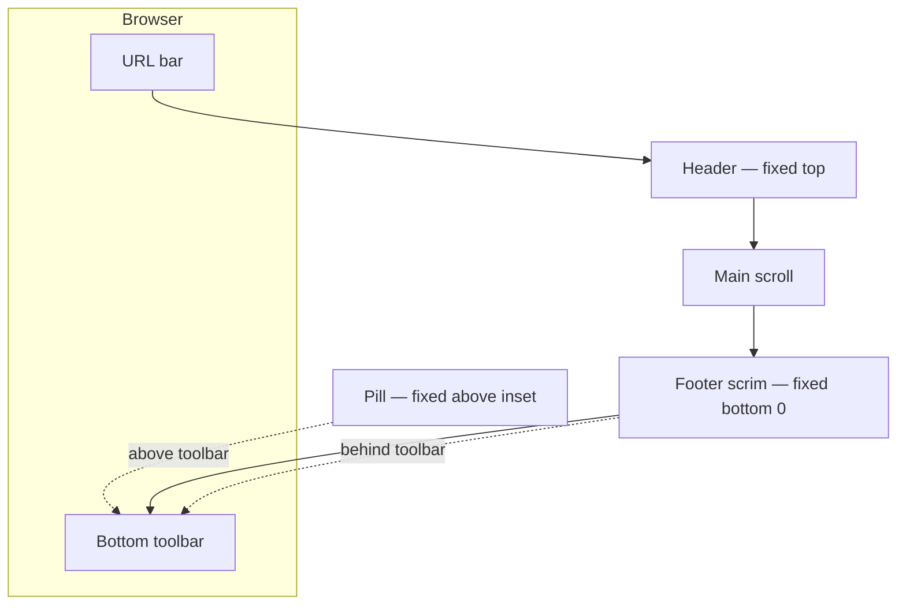

# Page layout — layer stack and agent handoff

<!-- parent: SPEC-feature-page-layout -->

**Scope:** every signed-in route on **mobile Safari in-browser** (`< md`) —
`/methods`, `/words`, `/progress`, drill-ins, review. Screenshots: `/words` and
`/progress` with Safari bottom toolbar visible.

Use this file when fixing **footer scrim vs pill positioning** or **nav pill
padding** — not destination IA or nav count.

---

## Issue brief (for the next agent)

### Symptom (all mobile pages)

On any `(app)` page in iOS Safari, the learner sees:

1. Safari URL bar (browser)
2. App floating header (title + corner chips + header scrim)
3. Scrollable page body
4. App destination pill **above** Safari’s bottom toolbar (back / share / refresh)

**Two separate problems.** Only the second is a bug to fix.

### A · Pill lifts with Safari toolbar — **correct, keep**

When Safari’s bottom toolbar appears, the **destination pill moves up** with it
(via `useVisualViewportBottomInset` + `.shell-float-nav-bottom`). The pill and
Safari controls read as one band — **that is acceptable** and may even be
desirable. Do **not** pin the pill to the physical bottom of the screen when
Safari chrome is present.

**Owner:** `useVisualViewportBottomInset.ts`, pill positioning only.

### B · Footer scrim tied to pill container — **bug, fix**

Today `FooterScrim` and the pill share one positioned wrapper:

```tsx
<FooterScrim className="shell-float-nav-bottom fixed inset-x-0 z-50 md:hidden">
```

Because `.shell-float-nav-bottom` sets `bottom` on the **whole** `FooterScrim`
root, the **blur/tint scrim moves up with the pill** and **stops above Safari’s
toolbar**. It does not bleed to the physical bottom of the viewport.

**Expected:**

| Layer | Anchors to | Moves with Safari toolbar? |
| --- | --- | --- |
| **Footer scrim** (blur + tint + tap shield) | `bottom: 0` of the **layout viewport** | **No** — extends behind Safari toolbar |
| **Destination pill** | `bottom: calc(safe-area + visualViewport inset + gap)` | **Yes** — sits just above Safari bar |

The scrim must **not** live inside the same positioned box as the pill. Split
into two fixed siblings (or scrim `fixed bottom-0` + pill `fixed` with inset).

**Files:** `FooterScrim.tsx`, `FloatingShellChrome.tsx`, `app/globals.css`
(`.shell-float-nav-bottom`, new scrim height tokens if needed).

### C · No vertical padding around pill in scrim — **bug, fix**

When Safari toolbar is **absent** (idle / `/methods`), the pill sits at its
lowest position but the **scrim box is exactly the pill height** — no breathing
room above or below the pill inside the scrim band.

**Expected:** the scrim zone is taller than the pill; the pill is centred (or
inset) with **tokenised padding** above and below (`--spacing-shell-float-nav-gap`
already exists for bottom offset — may need a matching **scrim pad** token for
top/bottom inside the bleed area).

**Visible on:** every destination page; worst when `visualViewport` inset is `0`.

### What is **not** a bug

| Observation | Verdict |
| --- | --- |
| Safari URL / bottom toolbar visible | Environmental — cannot hide in-browser |
| Pill rises when Safari toolbar appears | **Correct** |
| Double-bar look (pill + Safari) | Acceptable trade-off; scrim full-bleed should soften it |
| Per-page content below fold | Feature layout, not shell (unless `pb` wrong) |

### Invariants — do not break

From [`28-mobile-desktop-layout.md`](../../study/28-mobile-desktop-layout.md):

- Phone (`< md`): floating pill + corner chips.
- Desktop + iPad (`≥ md`): flat top nav, no bottom pill.
- Review: pill **stays visible** during session (UC-063).
- No due-count badges in nav.
- Tap shield: dead zones around pill still block clicks to content underneath.

---

## Copy-paste prompt for implementer

```
Task: Fix mobile footer scrim vs destination pill layering (all signed-in pages)

Invariant: The destination pill MAY move up with iOS Safari's bottom toolbar
(useVisualViewportBottomInset) — keep that.

Bug 1 — Scrim must full-bleed to viewport bottom:
- Footer blur/tint/tap-shield anchors to bottom: 0 of the layout viewport.
- Scrim extends BEHIND Safari's toolbar; it must NOT move up when the pill moves.
- Today FooterScrim and pill share .shell-float-nav-bottom on one element — split them.

Bug 2 — Pill padding inside scrim:
- When the pill is at its lowest position (inset 0), the scrim band is taller than
  the pill with visible padding above and below the pill (use tokens, not magic px).

Files: FooterScrim.tsx, FloatingShellChrome.tsx, app/globals.css, mobile-nav-v2.md,
page-layout.layers.md, tests in mobile-nav-v2.test.tsx or shell-page-content.

Verify: npm run verify
LIVE CHECK (iOS Safari):
1. /methods (often no Safari toolbar) — scrim to bottom; pill padded in scrim.
2. /words or /progress (toolbar often visible) — pill above toolbar; scrim still
   bleeds to physical bottom behind toolbar.
3. Tap scrim dead zone — content does not receive tap.
```

---

## Layer stack (mobile — intended after fix)

Z-order increases downward. **Scrim and pill use different `bottom` anchors.**

```
┌─────────────────────────────────────────────────────────────┐
│ L7  Language popover (when open)              z: 100–102    │
├─────────────────────────────────────────────────────────────┤
│ L6  Safari URL bar                            [browser]       │
├─────────────────────────────────────────────────────────────┤
│ L5  App floating header                       fixed z-50    │
│     HeaderScrim + title + corner chips                      │
├─────────────────────────────────────────────────────────────┤
│ L4  SCROLL — <main> → ShellPageContent → feature            │
│     pt: --shell-float-top-active                            │
│     pb: --spacing-shell-float-bottom  (clears pill + pad)   │
├─────────────────────────────────────────────────────────────┤
│ L3  Footer scrim ONLY                         fixed z-50    │
│     bottom: 0  (FULL viewport — behind Safari toolbar)      │
│     blur + tint + tap shield; taller than pill               │
├─────────────────────────────────────────────────────────────┤
│ L2  Destination pill                          fixed z-50    │
│     bottom: safe-area + visualViewport inset + gap          │
│     pill centred in scrim band with pad top/bottom          │
├─────────────────────────────────────────────────────────────┤
│ L1  Safari bottom toolbar                     [browser]       │
│     (--shell-visual-viewport-bottom-inset measures this)    │
└─────────────────────────────────────────────────────────────┘
```

### Current (broken) vs intended

| | **Before** | **After (2026-08-15)** |
| --- | --- | --- |
| Scrim `bottom` | Same as pill (`shell-float-nav-bottom`) | `0` — `.shell-float-footer-scrim` |
| Scrim height | Wraps pill only | Grows with `--shell-visual-viewport-bottom-inset` |
| Pill `bottom` | Shared wrapper | `.shell-float-nav-pill` + pad-y tokens |
| Safari toolbar | Scrim stopped above it | Scrim continues behind it |

### Scroll vs fixed

| Region | Scrolls? |
| --- | --- |
| `<main>` content | **Yes** |
| Header chrome | No |
| Footer scrim | No — **viewport bottom** |
| Destination pill | No — **above Safari inset** |
| Safari chrome | No |

---

## Page content (example routes)

All use `ShellPageContent` + `scrollable-destination` or drill-in unless review
runner. Shell fix applies **equally** — no per-route exception.

| Route | Feature body |
| --- | --- |
| `/methods` | `MethodMenu` |
| `/words` | `WordsHome` |
| `/progress` | `ProgressReport` |
| `/methods/[id]` | `MethodDetail` |
| `/words/review` (active) | `ReviewSession` — `one-screen-runner`; pill still visible |

---

## Token notes

| Token | Role |
| --- | --- |
| `--shell-visual-viewport-bottom-inset` | Pill lift only — **not** scrim `bottom` |
| `--spacing-shell-float-nav-gap` | Gap between pill and Safari toolbar |
| `--spacing-shell-float-nav-height` | Pill row height (icon chips) |
| `--spacing-shell-float-bottom` | `<main>` pb — reserves space for pill + inset |
| *TBD* | Scrim band height and/or pill pad inside scrim |

---

## Desktop / iPad (`≥ md`)

No footer scrim or bottom pill. Sticky flat `DesktopShellHeader` only. This
handoff does not apply.

---

## Mermaid (intended)



---

## Related specs

- [`page-layout.md`](page-layout.md)
- [`mobile-nav-v2.md`](mobile-nav-v2.md) — behaviour #9 (update when fixed)
- [`../../TRAPS.md`](../../TRAPS.md) — Safari / visualViewport
- [`../../study/28-mobile-desktop-layout.md`](../../study/28-mobile-desktop-layout.md)
