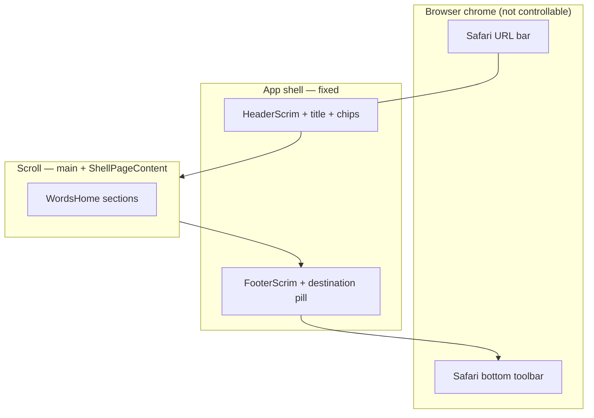

# Page layout — layer stack and agent handoff

<!-- parent: SPEC-feature-page-layout -->

Reference page: **`/words`** in **`scrollable-destination`** mode on **mobile Safari
in-browser** (`< md`). Screenshot context: Vercel preview, Italian active,
review card visible, "Your vocabulary" heading at the bottom edge, Safari bottom
toolbar present under the app pill.

Use this file when fixing **vertical budget**, **chrome stacking**, or **first-screen
composition** — not when changing destination IA or nav count.

---

## Issue brief (for the next agent)

### What the screenshot shows

On `/words` in iOS Safari (not Home Screen PWA), the learner sees **four vertical
bands** competing for height:

1. **Safari URL bar** (browser — not app code)
2. **App floating header** — language chip, centred title "Words", account chip, header scrim
3. **Scrollable page body** — review action card + start of vocabulary sections
4. **App bottom destination pill** + **Safari bottom toolbar** (back / share / refresh)

The app pill sits **above** Safari's toolbar via `useVisualViewportBottomInset`
([`TRAPS.md`](../../TRAPS.md)). That is **working as designed**, but it reads as
**two bottom bars** — learners may think the layout is broken.

### What is wrong vs what is environmental

| Observation | Bug? | Owner |
| --- | --- | --- |
| Safari URL bar and bottom toolbar visible | **No** — cannot hide in in-browser Safari; only absent in standalone PWA | Document / accept |
| App pill floats above Safari toolbar | **No** — `visualViewport` inset | `useVisualViewportBottomInset.ts` |
| `/words` often has Safari toolbar; `/methods` often does not | **No** — page-dependent Safari behaviour | Compare routes in LIVE CHECK |
| First screen is mostly review CTA; counts/orbit below fold | **Maybe** — product/UX, not shell bug | `WordsHome.tsx`, `words-home.md` |
| "Your vocabulary" heading tight against bottom chrome | **Maybe** — check `pb-page-bottom` + `--spacing-shell-float-bottom` | `ShellPageContent`, `AppShell` |
| Double bottom bar aesthetic | **Maybe** — visual polish (scrim, spacing), not removal of pill | `FooterScrim`, tokens |

### Invariants — do not break

From [`28-mobile-desktop-layout.md`](../../study/28-mobile-desktop-layout.md) (owner 2026-08-15):

- **Phone (`< md`):** floating pill + corner chips — permanent.
- **Desktop + iPad (`≥ md`):** flat sticky top nav — no bottom pill.
- **Review:** destination pill **stays visible** during session (UC-063).
- **No** due-count badges in nav.

### Suggested task framing

> **Reduce perceived chrome weight on `/words` first screen** without removing
> floating nav or hiding Safari toolbar. Verify scroll end clears pill + Safari
> inset; optionally tighten review card vertical rhythm so counts enter the fold
> on common phone heights (e.g. iPhone 15, 390×844).

**Files likely in scope:** `features/words/WordsHome.tsx`, `app/globals.css`
(page/shell tokens), `FooterScrim.tsx`. **Out of scope:** `interactive-widget`,
fixed `rem` lifts, flex-only shell, immersive nav hide.

**Verify:** `npm run verify`; LIVE CHECK on `/words` and `/methods` in iOS Safari
with toolbar on/off.

---

## Layer stack (mobile, scrollable destination)

Z-order increases downward. Only **app layers** are controllable.

```
┌─────────────────────────────────────────────────────────────┐
│ L7  Language switcher popover (when open)     z: 100–102    │
├─────────────────────────────────────────────────────────────┤
│ L6  Safari URL / status bar (browser)         not app code  │
├─────────────────────────────────────────────────────────────┤
│ L5  App floating header (HeaderScrim)         fixed z-50    │
│     · safe-area-inset-top padding                           │
│     · language chip | ShellPageTitle | account chip         │
├─────────────────────────────────────────────────────────────┤
│ L4  SCROLL — document / <main id="main">                    │
│     · pt: var(--shell-float-top-active)                     │
│     · pb: var(--spacing-shell-float-bottom)                 │
│     └─ ShellPageContent (scrollable-destination)            │
│        · pt-page-top / pb-page-bottom                       │
│        └─ WordsHome sections (review card, counts, …)       │
├─────────────────────────────────────────────────────────────┤
│ L3  FooterScrim tap shield + blur/tint        fixed z-50    │
│ L2  App destination pill (IconLink × 3)       inside scrim  │
├─────────────────────────────────────────────────────────────┤
│ L1  Safari bottom toolbar (browser)           visualViewport│
│     inset → --shell-visual-viewport-bottom-inset            │
└─────────────────────────────────────────────────────────────┘
```

### Scroll vs fixed

| Region | Scrolls? | Component |
| --- | --- | --- |
| Safari chrome | No (browser) | — |
| Floating header | No | `FloatingShellChrome` → `HeaderScrim` |
| `<main>` content | **Yes** | `AppShell` → route → `ShellPageContent` → feature |
| Footer scrim + pill | No | `FooterScrim` + `DestinationNavItems` `layout="pill"` |
| Safari bottom bar | No (browser) | Measured only |

---

## `/words` content structure (inside L4)

Top to bottom inside `ShellPageContent width="wide"`:

| # | Block | Component | Notes |
| --- | --- | --- | --- |
| 1 | Intent + review CTA | `WordsHome` §1 `section` | Raised card; full-width Start review on mobile |
| 2 | Held / fragile / new counts | `WordsHome` §2 | `sm:grid-cols-3` |
| 3 | Frequency blocks | `WordsHome` §3 | |
| 4 | 30-day horizon chart | `WordsHome` §4 | horizontal scroll |
| 5 | Vocabulary orbit | `VocabularyOrbitField` | |

Mode: `shellPageLayout("/words")` → `scrollable-destination`
([`lib/shell-page-layout.ts`](../../../lib/shell-page-layout.ts)).

---

## Token contract (mobile `/words`)

| Token | Typical role on `/words` |
| --- | --- |
| `--shell-float-top-active` | ~5.5rem (6.5rem if title wraps two lines) |
| `--spacing-shell-float-bottom` | pill height + Safari inset + gap |
| `--shell-visual-viewport-bottom-inset` | ~0 on `/methods`, ~44–50px when Safari toolbar shown |
| `--spacing-page-top` | First content breathing room inside scroll area |
| `--spacing-page-bottom` | Last section clears app pill (not Safari — shell pb handles pill) |

**Invariant:** `pb-page-bottom` on `ShellPageContent` + `pb-shell-float-bottom` on
`<main>` must together clear the pill; do not add a third bottom pad in
`WordsHome`.

---

## Desktop / iPad (`≥ md`) — same route, different chrome

Layers collapse to:

```
┌─────────────────────────────────────────────────────────────┐
│ L3  Language popover (if open)                z: 100–102    │
├─────────────────────────────────────────────────────────────┤
│ L2  Sticky flat header (DesktopShellHeader)   sticky z-50   │
│     · inline language + NavLink row + account               │
│     · ShellPageTitle centred (single line)                  │
├─────────────────────────────────────────────────────────────┤
│ L1  SCROLL — <main> (no shell float pt/pb)                  │
│     └─ ShellPageContent → WordsHome (same sections)         │
└─────────────────────────────────────────────────────────────┘
```

No L2/L3 footer layers. Runner mode on `/words/review` is separate — see
[`page-layout.md`](page-layout.md) `one-screen-runner`.

---

## Mermaid (mobile scrollable destination)



---

## Related specs

- [`page-layout.md`](page-layout.md) — modes and acceptance criteria
- [`mobile-nav-v2.md`](mobile-nav-v2.md) — pill and scrim behaviour
- [`../page/words.md`](../page/words.md) — Words destination contract
- [`../feature/words-home.md`](../feature/words-home.md) — section content
- [`../../study/28-mobile-desktop-layout.md`](../../study/28-mobile-desktop-layout.md) — breakpoint decisions
