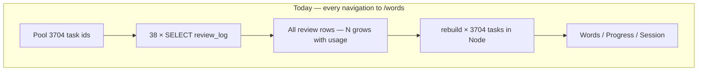
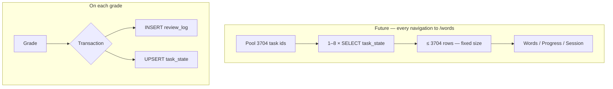

# Task state — supplement

<!-- parent: SPEC-service-task-state -->

Schema comparison, performance model, migration, and method grade mapping.
Normative rules live in [`task-state.md`](task-state.md); this file is reference.

---

## Database today (read path)

Every grade appends one row. Every page load **re-fetches all rows** for the
pool and **replays** FSRS.

```sql
-- public.review_log (simplified)
create table public.review_log (
  id              uuid primary key,
  user_id         uuid not null references auth.users (id) on delete cascade,
  installation_id uuid not null,
  task_id         text not null,          -- e.g. 'es:hablar:meaning-recall'
  grade           text not null,          -- again | hard | good | easy
  reviewed_at     timestamptz not null,
  latency_ms      integer not null,
  review_id       uuid,                   -- idempotency (optional)
  created_at      timestamptz not null default now()
);

create index review_log_user_task_reviewed_at_idx
  on public.review_log (user_id, task_id, reviewed_at);
```

**Example — one learner, three reviews on `es:hola:meaning-recall`:**

| id | user_id | task_id | grade | reviewed_at |
| --- | --- | --- | --- | --- |
| …01 | u-1 | es:hola:meaning-recall | good | 2026-08-01 |
| …02 | u-1 | es:hola:meaning-recall | again | 2026-08-05 |
| …03 | u-1 | es:hola:meaning-recall | good | 2026-08-06 |

**To show `/words` today**, the app:

1. Loads **3704** task ids (Spanish: 2000 meaning + 1704 form)
2. Runs **38** batched `review_log` queries (`in` chunks of 100)
3. Returns **every row** for those tasks (grows forever)
4. Replays each task's history through `rebuild()` in Node



---

## Database future (hybrid)

**Append log stays.** Add **one materialized row per task per user**, updated in
the same transaction as each append.

```sql
create table public.task_state (
  user_id          uuid not null references auth.users (id) on delete cascade,
  task_id          text not null,
  word_id          text not null,
  state            text not null,       -- new is NOT stored; row exists after 1st review
  stability        double precision,    -- null until first review completes
  difficulty         double precision not null default 5.0,
  due              timestamptz not null,
  last_review_at   timestamptz,
  lapses           integer not null default 0,
  last_grade       text,                -- again | hard | good | easy
  review_count     integer not null default 0,
  weights_version  text not null,
  updated_at       timestamptz not null default now(),
  primary key (user_id, task_id),
  constraint task_state_state_check check (
    state in ('learning','review','relearning','suspended','retired')
  ),
  constraint task_state_grade_check check (
    last_grade is null or last_grade in ('again','hard','good','easy')
  )
);

create index task_state_user_due_idx
  on public.task_state (user_id, due);

create index task_state_user_state_idx
  on public.task_state (user_id, state);
```

**Same learner after the three reviews above — log unchanged, plus one state row:**

`review_log` — still 3 rows (export, audit, UC-024).

`task_state` — **1 row** (current memory):

| user_id | task_id | state | stability | due | last_grade | review_count |
| --- | --- | --- | --- | --- | --- | --- |
| u-1 | es:hola:meaning-recall | review | 12.4 | 2026-08-20 | good | 3 |

**To show `/words` future:**

1. One query: `SELECT … FROM task_state WHERE user_id = $1 AND task_id = ANY($2)`
2. Returns **≤ 3704 rows**, fixed width — **independent of review count**
3. Map rows to `Task` — no `rebuild()`



---

## Speed model (shipped Spanish pool)

Constants from repo today:

| Constant | Value |
| --- | --- |
| Meaning-recall tasks | 2000 |
| Form-recall tasks | 1704 |
| **Pool total** | **3704** |
| Batch size (`TASK_ID_CHUNK`) | 100 |
| Batches per read today | **38** (parallel) |
| Slim log row (wire) | ~50 B (`task_id`, `grade`, `reviewed_at`) |
| `task_state` row (wire) | ~120 B (all scheduler fields) |

### Data transferred per `/words` or `/progress` load

| Learner history | `review_log` rows (approx) | **Today** transfer | **Future** transfer |
| --- | --- | --- | --- |
| New (0 reviews) | 0 | ~0 | ~0 (no state rows) |
| 1 month active (~3× pool) | ~11k | **~0.5 MB** | **~0.44 MB** (3704 cap) |
| 1 year (~20× pool) | ~74k | **~3.7 MB** | **~0.44 MB** |
| 5 years heavy (~100× pool) | ~370k | **~18 MB** | **~0.44 MB** |

Future read size **plateaus at pool size**. Today it grows with every review forever.

### Latency model (order-of-magnitude)

Assumptions: Supabase EU ~80–120 ms RTT; 38 parallel batches ≈ one wave;
serverless CPU ~1–3 s budget.

| Stage | Today (1 year history) | Future |
| --- | --- | --- |
| Auth + layout (after PR #42) | ~150–250 ms | ~150–250 ms (unchanged) |
| DB fetch | ~150–400 ms + **3.7 MB** | ~80–150 ms + **0.44 MB** |
| Node `rebuild` × 3704 tasks | **~300–800 ms** CPU | **~5–20 ms** map rows |
| **Typical page TTFB delta** | baseline | **~0.5–1.5 s faster** at 1y; **~2–4 s faster** at 5y |

Exact numbers depend on region, review distribution, and Vercel cold start. The
**scaling shape** is what matters: today is **O(reviews)**; future is **O(tasks)**.

### Where caching (PR #42) vs task_state helps

| Fix | What it removes | Stops growing with history? |
| --- | --- | --- |
| Auth dedup + `React.cache` | Duplicate calls per click | No |
| Slim `SELECT` columns | ~60% smaller log rows | No |
| Catalogue module cache | Disk parse on `/methods` | N/A |
| **`task_state`** | Full replay on read | **Yes** |

---

## Backfill migration

1. Deploy `task_state` table + RLS + `upsert` policy.
2. Server-side job (or migration SQL with caution): per `user_id`, stream
   `review_log` ordered by `reviewed_at`, `rebuild` per `task_id`, bulk upsert
   `task_state`.
3. Flip read paths behind no feature flag — parity tests gate the cutover.
4. Keep `listReviewsForTaskIds` for export/backfill only; grep enforces no
   page-level callers (AGENTS.md change-completeness).

Accounts with no reviews: zero `task_state` rows — correct (`new` tasks).

---

## Method grades (provisional)

Card-engine methods **must** emit a scheduler `Grade` before write. Examples for
gap-fill (product to confirm per method):

| Learner outcome | Proposed grade | Rationale |
| --- | --- | --- |
| Did not know the word | `again` | full lapse |
| Wrong fill / partial | `hard` | remembered something, not solid |
| Correct fill | `good` | standard success |
| Effortless / fast | `easy` | optional stretch |

Each outcome still runs the **same transactional write** as Words review: log row
+ state upsert. No separate "method mistakes" table in stage 1.

---

## "Words I struggle with" (future query)

With `task_state`, no replay:

```sql
select task_id, stability, last_grade, due
from public.task_state
where user_id = auth.uid()
  and task_id like 'es:%:meaning-recall'
  and (
    state in ('learning', 'relearning')
    or last_grade in ('again', 'hard')
  )
order by due asc
limit 100;
```

Today the same filter requires loading all history and rebuilding every task.
