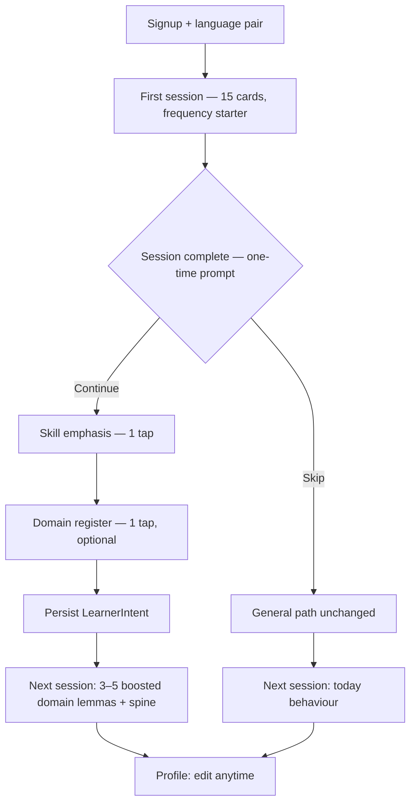

# 49 · Learner intent onboarding — expert panel study

**Status:** study only — no implementation.  
**Brief:** Owner asks whether new users can be asked what they want to do
(speak, read, listen, …) and whether they learn for **Business**, **Alltag**, or
**Technik** — so those words appear **more often**, perhaps **early**, and the
learner feels the app **respected their choice**.

This chapter records a structured review from three roles — **UX designer
(UX)**, **language teacher (LT)**, **data scientist (DS)** — and a single
recommended design. It extends [UC-019](../use-cases/UC-019-learn-for-something-specific.md),
[08](08-motivation.md) M7, [24](24-speaking-as-the-goal.md), and [21](21-method-catalogue-and-context.md).

---

## I0 · What the owner is really asking for

Two separate knobs, often conflated:

| Knob | Example answers | What it should change |
| --- | --- | --- |
| **Skill emphasis** | speak · read · listen · write · balanced | Which skill leads Home, which methods get a **floor**, which content surfaces first |
| **Domain register** | Business · Alltag · Technik | Which **lemmas** are boosted in the vocabulary queue — meeting, invoice, kitchen, API |

The desired **feeling** — *"the app heard me"* — is a **competence signal**
([08](08-motivation.md) M5), not a welcome animation. It requires **visible
consequence within the first week**, ideally within the **first three sessions**.

---

## I1 · UX designer review

**Role:** onboarding friction, information scent, trust, changeability.

### I1a · The hard constraint — UC-011 wins the first minute

[UC-011](../use-cases/UC-011-start-in-the-first-minute.md) and [01](01-duolingo.md)
S1 are **[A]**: every screen before the first exercise costs users permanently.
The account is already the one allowed step ([ADR-0006](../adr/0006-require-an-account.md)).

> **Do not ask intent before the first card is graded.**

A survey at signup rebuilds the barrier Duolingo removed. The owner's idea is
right; the **timing** must be after value is proven.

### I1b · When to ask — the "earned question" pattern

| Moment | Fit | Why |
| --- | --- | --- |
| **Before first exercise** | **No** | Violates UC-011; no trust yet |
| **After first session complete** | **Best default** | Learner has felt the product; question explains *why the next session may differ* |
| **After 3 sessions / day 2 return** | Acceptable fallback | For learners who bounce mid-session |
| **Profile-only, never prompted** | **Too weak** | UC-019 failure mode — "onboarding theatre" |

Recommended trigger: **session-complete screen**, once, skippable with equal visual
weight on **Skip for now** and **Continue**.

### I1c · How many questions — two screens maximum

Eight skill × domain combinations is a **decision tree**, not onboarding.

**Screen 1 — skill emphasis (required if they continue):**

```
  What do you most want this language for?

  ○ Speaking — hold conversations
  ○ Reading — articles, books, news
  ○ Listening — podcasts, meetings, audio
  ○ Writing — messages, reports, notes
  ○ Balanced — no single priority
```

**Screen 2 — domain register (optional second tap):**

```
  Which words should we bring forward first?

  ○ Business — meetings, email, office
  ○ Everyday — home, travel, small talk
  ○ Technical — tools, docs, engineering
  ○ General — frequency order only
```

**Do not combine** skill and domain on one dense form. Progressive disclosure
keeps abandonment low.

### I1d · Copy that creates "respected" — transparency, not magic

The feeling fails when the app **claims** personalization without proof. It
succeeds when the learner can **audit** it:

| Bad | Good |
| --- | --- |
| "Personalized just for you!" | "Next up: *reunión*, *contrato* — you chose Business" |
| Silent reweighting | Tap **Why this word?** → "Boosted because you chose Business · still frequency-ordered within that band" |
| Changing goal wipes progress | "Changing domain adjusts **what comes next**, not what you already know" |

Session-complete line (example): *"Three of today's fifteen words match Business —
that is because you asked for it. Change anytime in Profile."*

### I1e · Visual design constraints

- Reuse existing **Field / Button** patterns — no new illustration-heavy wizard.
- **Skip** is not greyed out; skipping is a valid answer (general path).
- Profile entry: same two questions, editable, with **last changed** date.
- No streak, no progress bar on the intent form itself ([08](08-motivation.md) —
  controlling framing).

### I1f · UX verdict

| | |
| --- | --- |
| **Ship?** | **Yes — after first session**, not at signup |
| **Risk** | Asking too early → drop-off; asking too late → "theatre" |
| **Mitigation** | One prompt, skippable, provably changes the next queue |

---

## I2 · Language teacher review

**Role:** register, skill development order, didactic honesty.

### I2a · Skill emphasis — align with study 24, do not corrupt measurement

[24](24-speaking-as-the-goal.md) already resolves the "different goals" problem:

> Input is the precondition. Speaking is the goal. The goal changes **what is
> foregrounded**, never **what is true**.

So **Speaking** as skill emphasis should:

- Lead the **Home headline** with the speaking sub-level gap
- Raise **floors** on production methods (4/3/2, free production)
- **Not** inflate the speaking level number or reweight the overall formula

**Reading** or **Listening** emphasis inverts the headline and floors — legitimate
for a learner preparing for an exam or audiobook immersion. **Balanced** restores
today's neutral behaviour.

This is **targeting**, not **gating** ([26](26-readiness-and-difficulty.md)):
every method stays available; emphasis changes **offer rate** and **copy**, not
permission.

### I2b · Domain register — Business / Alltag / Technik

These three buckets are **coarse but usable** for v1 if defined as **lemma tags**,
not as separate courses:

| Register | Lemma examples (ES) | Notes |
| --- | --- | --- |
| **Business** | *reunión, contrato, cliente, presupuesto, empresa* | Formal *usted* contexts; email phrases later in methods, not day-1 cards |
| **Alltag** | *casa, comida, familia, calle, tiempo* | Overlaps general frequency list — boost is subtle |
| **Technik** | *sistema, datos, error, archivo, conectar* | High overlap with English cognates for DE→ES/IT; still worth boosting for non-cognate lemmas |

**Overlap is expected.** ~40 % of top-500 general-frequency lemmas appear in more
than one register. Tagging is **multi-label**; boosting uses **max weight**, not
exclusive buckets.

**Alltag ≈ general path.** When the learner skips domain or picks Alltag, fall
back to today's frequency-ordered starter — no penalty.

### I2c · "Early" must not mean "skip the base"

A Business learner still needs high-frequency glue (*ser, estar, de, que, por*).
Domain boost should **reorder within the next N introductions**, not **replace**
the frequency spine.

Proposed **blend** for new-card picks while intent is set:

```
effectivePriority = frequencyRank × domainWeight(lemma) × skillWeight(lemma)
```

where `domainWeight ∈ [0.7, 1.3]` (narrow band — DS enforces), and lemmas outside
the top 3 000 by frequency are **never** boosted above rank 500 equivalent.

**First week target:** 3–5 domain-tagged lemmas per 15-card session, not 15/15.
The learner should still recognise the session as "normal vocabulary", with a
**visible minority** aligned to their register.

### I2d · Speaking vs Business — the common case

Many learners pick **Speaking + Business**. Didactically:

1. **Week 1–2:** meaning-recall on boosted Business lemmas + general spine
2. **Week 2+:** production floors rise ([24](24-speaking-as-the-goal.md)); role-play
   methods draw Business **sentence templates** from held lemmas
3. **Do not** promise "you can negotiate contracts at B1" — UC-019 success criterion

### I2e · Relation to learning context ([21](21-method-catalogue-and-context.md))

**Intent ≠ context.** "Business" does not mean "at my desk". Context (eyes free,
time, writing surface) still filters **methods first**. Intent filters **words and
topics** inside methods that already passed context.

Order remains: **context → floor → effect → preference → intent weighting**.

### I2f · LT verdict

| | |
| --- | --- |
| **Ship?** | **Yes**, with narrow boost band and general spine preserved |
| **Blocker** | Lemma register tags do not exist in `data/` yet — content work, not UI |
| **Anti-pattern** | Separate Business deck that forks progress ([10](10-antipatterns.md) — parallel truths) |

---

## I3 · Data scientist review

**Role:** ranking model, measurability, regression risk, A/B ethics.

### I3a · One queue, weighted sampling — not a second deck

Duolingo D7 and [09](09-feature-catalogue.md) F14 already say: goal-dependent
selection is **cheap** because it is a **different frequency list**. The shipped
code path today:

| Component | Role |
| --- | --- |
| [`lib/starter-deck.ts`](../../lib/starter-deck.ts) | Frequency-ordered first cards |
| [`lib/session-builder.ts`](../../lib/session-builder.ts) | New cards sort by `frequencyRank`; gap-set cookie boosts |
| [`lib/content-gap.ts`](../../lib/content-gap.ts) | Source-driven gap lemmas — **precedent for intent boost** |
| [`docs/specs/service/session-sampling.md`](../specs/service/session-sampling.md) (UC-079 spec) | Probabilistic composition — **natural home for intent weights** |

> **Do not fork decks.** One task graph per learner; intent is a **weight vector**
> over lemmas, stored on the profile, applied at sample time.

### I3b · Parameters (v1 defaults — calibration, not gospel)

| Parameter | Default | Rationale |
| --- | --- | --- |
| `domainBoost` | 1.25× for tagged lemmas in chosen register | Visible but not dominant |
| `domainDemote` | 0.85× for lemmas tagged **only** in other registers | Keeps session diverse |
| `maxBoostedPerSession` | 5 of 15 new introductions | LT spine rule |
| `minGeneralSpine` | ≥ 8 of 15 cards from top-1000 frequency | Prevents narrow tunnel |
| `boostDecay` | Linear to 1.0× over 60 days or 200 held lemmas | Intent is starting bias, not permanent filter |
| `skillEmphasis` | Floor multipliers on method catalogue only | No change to FSRS |

**FSRS unchanged.** Intent affects **which card enters the session**, not
`applyReview` intervals ([44](44-foundation-phase-expert-review.md) P1a).

### I3c · Data model (sketch)

```typescript
type SkillEmphasis = "speaking" | "reading" | "listening" | "writing" | "balanced";
type DomainRegister = "business" | "everyday" | "technical" | "general";

type LearnerIntent = {
  skill: SkillEmphasis;
  domain: DomainRegister;
  setAt: string; // ISO
  source: "post_session_one" | "profile" | "skipped";
};
```

Content side (new, in `data/`):

```typescript
type LemmaRegisterTag = {
  lemma: string;
  registers: DomainRegister[]; // multi-label
  confidence: "curated" | "inferred";
};
```

Start with **curated lists of ~150 lemmas per register per language** (ES, IT
first). LLM-assisted tagging is lane C ([48](48-content-licensing-and-adaptation.md))
— human spot-check before boost.

### I3d · Measurability — prove "respected" or kill the feature

Log per session (analytics):

- `intentSkill`, `intentDomain`
- `boostedLemmaCount`, `boostedLemmaIds[]`
- `learnerChangedIntentWithin7d` (volatility signal)

**Primary success metric (4-week window):**

| Metric | Hypothesis |
| --- | --- |
| **Intent confirmation rate** | ≥ 60 % of prompted users set non-general intent |
| **Early domain hit rate** | ≥ 3 boosted lemmas in first 3 sessions when domain ≠ general |
| **7-day return** | Intent cohort ≥ control + 5 pp (not significant alone — watch ratio with progress) |
| **Intent change rate** | < 25 % in week 1 suggests misfire; > 50 % suggests theatre |

**Guardrail:** boosted lemmas must not have **lower** `good` rate than spine lemmas
by > 10 pp — if they do, boost band is too aggressive or tags are wrong.

### I3e · Interaction with UC-079 session sampling

[UC-079](../use-cases/UC-079-build-a-core-vocabulary-with-natural-repetition.md)
weights by retrievability and held count ([`session-sampling.md`](../specs/service/session-sampling.md)).
Intent weight enters as a **third factor** on **new introductions only**:

```
P(new lemma L) ∝ exp(−λ · N_new) · domainWeight(L) · 1/frequencyRank(L)
```

Resurfacing and due cards are **untouched** — intent shapes **what new base you
build**, not **what you maintain**.

### I3f · DS verdict

| | |
| --- | --- |
| **Ship?** | **Yes — v1 with tight band + logging** |
| **Defer** | ML-inferred register from reading history — needs consent + cold start |
| **Kill switch** | `intentBoostEnabled: false` per language if tags incomplete |

---

## I4 · Unified recommendation

### I4a · The flow



### I4b · What changes for the learner (visible)

| Surface | Change |
| --- | --- |
| **Session complete (once)** | Intent prompt |
| **Next 3 session intros** | "Includes words for Business" chip |
| **Card / G1 reason** | "Boosted: Business" when applicable |
| **Home headline** | Skill emphasis ([24](24-speaking-as-the-goal.md)) |
| **Weekly reflection** | "Most progress toward **speaking** this week" / domain-aware examples |
| **Methods menu** | Floors shift per skill emphasis |

### I4c · What does not change

- Level measurement ([03](03-level-model.md))
- FSRS intervals ([04](04-flashcards-srs.md))
- UC-011 first-minute rule
- Single task graph — no parallel Business deck

---

## I5 · "Respected" — operational definition

The panel agrees: **respected** is observable when all three hold within **7 days**:

1. **Predictive** — learner can name one word they saw *because* of their choice
2. **Reversible** — changing Business → Alltag changes the *next* queue, stated aloud
3. **Non-punitive** — skipping or changing never deletes held lemmas

If only (1) fails, the boost is too weak or invisible. If (2) fails, tags or UI
copy is wrong. If (3) fails, trust is destroyed — **Sensitive** regression.

---

## I6 · Open questions (owner decisions before spec)

1. **Third domain bucket name** — *Technik* vs *Fachsprache* vs *Professional
   (non-business)* — technical docs vs medical/legal?
2. **Exam / travel intents** — fold into domain, add fourth bucket, or defer to v2?
3. **Multi-intent** — "Business + Speaking" is two fields today; allow **secondary
   domain at 1.1×** or keep one domain only?
4. **Tag ownership** — who curates ES/IT register lists ([18](18-language-kit.md))?
5. **Decay** — 60-day boost fade: too fast for slow learners, too slow for goal
   changers?
6. **Placement test interaction** — if offered post-session-1, does intent pre-empt
   or follow placement?

---

## I7 · Implementation map (when this ships)

| Artefact | Purpose |
| --- | --- |
| `docs/study/49-learner-intent-onboarding.md` | This chapter |
| `docs/use-cases/UC-019-learn-for-something-specific.md` | **Extend** — add acceptance criteria for timing, transparency, boost band |
| `docs/specs/service/learner-intent.md` | Normative: storage, weights, decay, G1 reason codes |
| `docs/specs/data/lemma-register-tags.md` | Tag schema + curation rules |
| `data/intent/es-registers.json`, `it-registers.json` | Curated lemma lists |
| `lib/learner-intent.ts` | Weight functions — framework-free |
| `lib/session-sampling.ts` | Apply `domainWeight` on new picks |
| `features/onboarding/IntentPrompt.tsx` | Post-session-1 UI |
| `features/profile/IntentSettings.tsx` | Edit path |
| `messages/en.json`, `messages/de.json` | Prompt + G1 + session intro copy |

**Plans:** new slice **T-W23** Learner intent (after T-W22 session sampling code
lands). **Effort:** M (content tagging is the long pole).

---

## I8 · Feature catalogue (draft)

| # | Feature | Ev. | Eff. | Verdict |
| --- | --- | --- | --- | --- |
| F219 | Post-session-1 intent prompt (skill + domain), skippable | B | S | **V1 candidate** — [49](49-learner-intent-onboarding.md) |
| F220 | Domain register lemma boost in session sampling | C | M | **V1 candidate** — extends F14 |
| F221 | Skill emphasis → Home headline + method floors | B | M | **V1 candidate** — [24](24-speaking-as-the-goal.md) |
| F222 | G1 "Boosted: {register}" reason on cards | C | S | **V1 candidate** |
| F223 | Intent boost decay over 60 days | D | S | **V2** — calibrate after F220 data |
| F224 | Inferred register from reading sources | C | L | **later** — consent + cold start |

F14 in [09](09-feature-catalogue.md) is **superseded in place** by F220 with
narrower, measurable semantics — do not build both.

---

## I9 · Panel summary

| Role | One-line verdict |
| --- | --- |
| **UX** | Ask **after session 1**, two taps max, skip equal, prove it on the next queue |
| **LT** | Boost **within** the frequency spine; skill emphasis = floors + headline, not fake levels |
| **DS** | One graph, weight vector, log everything, 1.25× cap, decay to general |

**Consensus:** The owner's instinct is **directionally correct** and already
anticipated in UC-019, M7, F14, and study 24. The failure mode is **asking too
early** or **boosting invisibly**. The success mode is a learner who, on day 3,
can point at *reunión* and say: *"I got that because I said Business — and I can
change it."*

---

## Sources

| | Claim | Grade |
| --- | --- | --- |
| ⬤ | Pre-first-exercise steps cost permanent users | [A] — [01](01-duolingo.md) S1 |
| ◐ | Self-set goals support autonomy | [B] — [08](08-motivation.md) M7, SDT |
| ⬤ | Goal changes foregrounding, not measurement | [D] — [24](24-speaking-as-the-goal.md) |
| ○ | Goal-dependent frequency lists are cheap | [C] — [01](01-duolingo.md) D7, F14 |
| ⬤ | Context filters before preference | [D] — [21](21-method-catalogue-and-context.md) |
| ⬤ | One scheduler — composer layers only | [A] — [44](44-foundation-phase-expert-review.md) P1a |
| ○ | Register-tagged vocabulary lists in curriculum design | [C] — ESP / domain teaching practice |
