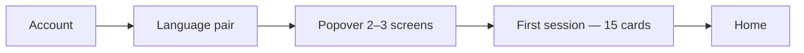

# 50 · Onboarding popover — timing, abholen, and whether to ask “skill”

**Status:** study only — supersedes the **timing** and **skill-question** parts of
[49](49-learner-intent-onboarding.md). Register **boost** from chapter 49 is
**withdrawn** by [51](51-register-path-and-interest-topics.md); this chapter fixes
*when* and *what* to ask (popover + interests page in 51).

**Owner correction (2026-08-20):** Study 49 recommended asking intent **after
session 1**. That was a panel inference from UC-011, **not** an owner decision.
The owner wants a **short popover/wizard up front** that **abholt** the learner,
and doubts the **skill** question (speak / read / listen / write) — speaking and
writing feel like one path, not a fork.

This chapter adds **internet-sourced evidence** and a revised recommendation.

---

## O0 · What study 49 got wrong (explicit correction)

| Study 49 said | Owner said | Verdict |
| --- | --- | --- |
| Ask **after** first session | Ask **up front** in a short popover | **Owner wins** — study 49 §I1b is withdrawn |
| Two knobs: **skill + domain** | Domain yes; skill probably **unnecessary** | **Investigate below** |
| “Earned question” pattern | **Abholen** — meet them before they feel lost | Different UX goal |

Study 49 remains valid for **transparency and profile-edit patterns** only.
Register **boost** mechanics are **withdrawn** — see [51](51-register-path-and-interest-topics.md).

**Unanimous:** Drop skill question v1. **Register = full path**, not boost (51).

---

## O1 · Internet research — when do apps ask?

### O1a · Duolingo — questions **before** the first lesson **[B — observed product]**

Public teardowns and screen recordings (Page Flows iOS capture 2024–2025; Gummble
2026; Appcues case study) show Duolingo **not** going straight to exercises:

Typical order **before** lesson 1:

1. Target language  
2. Self-reported level (or short quiz)  
3. **Motivation** — travel, career, family, brain training, …  
4. **Daily goal** — minutes / streak framing  
5. Animated “building your course”  
6. **Then** first lesson (often **before** account creation)

Sources: [Page Flows Duolingo iOS recording](https://pageflows.com/post/ios/onboarding/duolingo/),
[Gummble Duolingo flow analysis](https://gummble.com/blog/duolingo-onboarding-flow-analysis),
[Appcues Duolingo UX](https://goodux.appcues.com/blog/duolingo-user-onboarding).

**Why it works (product psychology, not SLA):** answers act as a **commitment
device** — the learner has already invested identity (“I’m here for career”) before
the first tap on a word. Duolingo also **defers signup** until after lesson 1,
which this product **cannot** ([ADR-0006](../adr/0006-require-an-account.md)).

> **Implication for us:** Duolingo’s “zero barrier” is **zero before any
> question**, not zero before any **goal** question. Our stricter UC-011 (“only
> account + language pair before first exercise”) is **more conservative than
> Duolingo**, not industry standard.

### O1b · 2025–2026 onboarding practice — short survey **after signup** **[C]**

Formbricks (2026) and Lifecycle Architect (language-app activation guide) converge:

- **2–3 questions** immediately after signup **if each answer changes the next
  screen** — not “personalization theatre”  
- More than **2 questions at this stage** increases drop-off before value  
- **Progressive profiling** later — do not front-load everything  
- Milestone check-ins (day 3–7) beat long upfront forms

Sources: [Formbricks onboarding best practices 2026](https://formbricks.com/blog/user-onboarding-best-practices),
[Lifecycle Architect — language app activation](https://lifecyclearchitect.com/guides/activation-optimization-for-language-learning-apps/).

ScreensDesign’s language-app onboarding survey (2025) adds:

- Separate **motivation** (context) from **desired capability** (outcome)  
- **First week** must visibly change from the answer — or cut the question  
- Avoid vague “become fluent fast” without defining fluent

Source: [ScreensDesign — 14 language onboarding examples](https://screensdesign.com/articles/language-learning-app-onboarding/).

Languavibe (2026) checklist: real personalization means early content **keeps
using** stated interests — interests that vanish after onboarding are template UX.

Source: [Languavibe onboarding check](https://languavibe.com/language-app-onboarding-check/).

### O1c · What “abholen” means in research terms

“Abholen” maps to three evidence-backed needs, not a fourth survey screen:

| Need | Theory | Onboarding job |
| --- | --- | --- |
| **Orientation** | Cognitive load (Sweller) — strip to one next action | “You’re in the right place; here’s what happens next” |
| **Autonomy** | SDT — self-endorsed goals, not imposed | Optional skip; change later; no wrong answer |
| **Competence preview** | Competence need satisfaction (Oga & Baldwin 2025) | Show **one example** of what changes (“words for your job”) |

SDT meta-analysis (Alamer et al., 2025): **autonomous motivation** correlates
with L2 achievement; autonomy support includes meaningful choice — but **forced
false precision** (pick one skill when you need all) **thwarts** autonomy.

Sources: [SDT L2 meta-analysis PDF](https://selfdeterminationtheory.org/wp-content/uploads/2025/06/2025_AlamerRobatEtAl_L2.pdf),
[Competence in L2 PDF](https://selfdeterminationtheory.org/wp-content/uploads/2025/06/2025_OgaBaldwinRyan_competence_in_L2.pdf).

**Abholen is not** “delay questions until later.” It is **short, human framing
before practice** so the first session is not a cold drop into cards.

---

## O2 · Internet research — should we ask “speak / read / listen / write”?

### O2a · Integrated skills — the pedagogical default **[B]**

Modern SLA and EFL literature treats the four skills as **interconnected**, not
independent tracks:

- Integrated-skills instruction yields **higher proficiency gains** than segregated
  instruction (mixed-methods study, n=240 ESL learners, 2025 — listening↔speaking
  r≈0.78, reading↔writing r≈0.82)  
- Speaking and writing **reinforce** each other: oral practice builds vocabulary
  and confidence for written organization; writing deepens structure for fluency  
- Real communication **never** uses one skill in isolation (CLT / ISA)

Sources: [TVCR 2025 integrated four skills](https://doi.org/10.53032/tvcr/2025.v7n3.05),
[ResearchGate — interconnectedness in lesson planning](https://www.researchgate.net/publication/386483547_Exploring_The_Interconnectedness_Of_Four_Language_Skills_In_Effective_Lesson_Planning),
[Integrative skills EFL review](https://doi.org/10.37745/bje.2013/vol13n68590).

> **LT conclusion:** Asking “Sprechen **or** Schreiben?” misrepresents how
> languages are learned. The learner who wants conversation **also** needs
> reading incoming messages and writing replies.

### O2b · What motivation research actually asks **[B]**

Adult motivation questionnaires (Gardner AMTB tradition; Realia 2024 Spanish
university sample; adult 30–60 study) cluster on **situation and outcome**, not
modality:

| Asked in research | Examples | Not asked as primary |
| --- | --- | --- |
| Instrumental / integrative | career, travel, family, hobby | “Pick listening” |
| Desired **capability** | “talk to colleagues”, “read news” | “Pick writing” |
| Time / commitment | realistic hours per week | — |

Realia (2024): motivation items include travel, degree requirement, career,
liking languages, talking to people — **not** “which skill tab do you want”.

Source: [Realia motivation survey](https://doi.org/10.7203/realia.32.27546).

ScreensDesign explicitly: **motivation = context**; **desired capability = what
the plan should support** — e.g. “watch movies”, “speak with natives”. That is
closer to **outcome** than **skill checkbox**.

### O2c · What study 24 already decided for the product **[D]**

[24](STUDY-022-speaking-as-the-goal.md): **Speaking leads the headline** and raises
production floors — this is a **product default**, not something every learner
must re-declare. A user who reads more still benefits from speaking-forward
measurement honesty.

**Skill question duplicates a decision the app already made.** Domain register
(Business / Alltag / Technik) is **user-specific**; speaking-first is
**product-specific**.

### O2d · Verdict on the skill question

| Option | Verdict |
| --- | --- |
| Ask speak / read / listen / write in onboarding | **Drop for v1** — weak evidence, pedagogically muddy, overlaps study 24 |
| Infer emphasis from **behaviour** later | **V2** — reading methods used → raise reading on Home |
| Ask **situation** instead (“meetings”, “travel”, “docs”) | **Optional v2** — maps to domain + content, not skill split |
| Keep study 24 speaking default silently | **Yes** |

Owner intuition **confirmed by research**: skill fork is **unnecessary** in the
popover; domain register is the high-signal question.

---

## O3 · Revised design — popover “abholen” (owner-aligned)

### O3a · Placement in the flow



**Not** after session 1. **Not** 38 Duolingo screens. **2–3 popover pages** between
language pick and first card.

This **conflicts with UC-011 as written** (“only account + language before first
exercise”). Recommended spec change: amend UC-011 to allow **one optional intent
popover** (≤3 screens, skippable) that **must** alter session-1 composition —
otherwise forbidden.

### O3b · Popover content (concrete)

**Page 1 — Abholen (orientation, no input)**

```
Willkommen. Kurz eingerichtet — dann geht’s los.

In den nächsten Minuten lernst du deine ersten Wörter.
Danach passen wir Vorschläge an deinen Alltag an.
```

[ Weiter ]

**Page 2 — Domain (only question that changes words)**

```
Welche Wörter sollen zuerst öfter vorkommen?

○ Business — Meetings, E-Mail, Büro
○ Alltag — Zuhause, Reise, Smalltalk
○ Technik — Tools, Docs, IT
○ Erstmal allgemein — häufigste Wörter
```

[ Weiter ]   [ Überspringen ]

**Page 3 — Confirm (competence preview, not another question)**

```
Alles klar.

Deine erste Session mischt allgemeine Basis-Wörter
mit ein paar aus Business — z. B. reunión, cliente.

Das kannst du jederzeit ändern.
```

[ Los geht’s — erste Session ]

**No skill page.** No “how much time” in v1 (context presets come later per [21](STUDY-019-method-catalogue-and-context.md)).

### O3c · What session 1 looks like after Business

Same 15 cards, same FSRS — but **3–5** Business-tagged lemmas in the new-card
slice (chapter 49 mechanics). Learner sees on session intro:

> *„4 Wörter für Business — du hast Business gewählt.“*

That is **abholen + respektiert** in one pass: they were asked, they see it
**in the first session**, not after a delay.

### O3d · UC-011 trade-off (honest)

| | After session 1 (study 49) | Popover before session 1 (this chapter) |
| --- | --- | --- |
| Drop-off risk | Lower before first touch | +1–3 screens friction |
| “Respektiert” signal | Delayed to session 2 | **Immediate** in session 1 |
| Duolingo parity | Lower | **Closer** (they ask before lesson 1) |
| UC-011 | Strict read | **Needs amendment** |

Industry data does **not** support “never ask before first exercise” universally —
it supports **short, actionable, skippable** asks. Our account-already-required
product has **less** room than Duolingo; **2–3** screens is the ceiling.

---

## O4 · Panel re-vote (same three roles)

| Role | Study 49 | **Study 50 (revised)** |
| --- | --- | --- |
| **UX** | After session 1 | **Popover 2–3 screens after language pick; skip equal; preview page 3** |
| **LT** | Skill + domain | **Domain only**; skills integrated; study 24 default |
| **DS** | Post-session prompt | **Intent before session 1** OK if ≤3 screens + session 1 proves it |

**Unanimous:** Drop skill question v1. **Register path + interests** — [51](51-register-path-and-interest-topics.md).

---

## O5 · Open questions

1. **UC-011 amendment** — owner GO to allow intent popover as third step?  
2. **Alltag vs General** — same boost path or separate tags?  
3. **Page 1 copy** — mascot / illustration or text-only ([STUDY-020](STUDY-020-visual-design.md))?  
4. **A/B** — popover vs skip-default: does session-1 completion rate hold?

---

## O6 · Implementation map delta

| Change from study 49 | To |
| --- | --- |
| `features/onboarding/IntentPrompt.tsx` after session 1 | **`IntentPopover.tsx` after language picker** |
| Two-question skill + domain | **Domain only** (+ confirm preview) |
| UC-011 unchanged | **UC-011 + UC-019 AC update** |

---

## Sources (web + repo)

| | Claim | Grade |
| --- | --- | --- |
| ⬤ | Duolingo asks motivation before lesson 1 | [B] — product teardowns |
| ◐ | 2-question post-signup survey if actionable | [C] — Formbricks 2026 |
| ◐ | First week must reflect stated motivation | [C] — ScreensDesign 2025 |
| ⬤ | Four skills taught integrated > segregated | [B] — TVCR 2025, ISA literature |
| ⬤ | Autonomous motivation ↔ L2 achievement | [B] — Alamer et al. 2025 meta |
| ⬤ | Motivation surveys use situation/outcome not modality | [B] — Realia 2024, Gardner tradition |
| ⬤ | Speaking leads headline — product default | [D] — [24](STUDY-022-speaking-as-the-goal.md) |
| ⬤ | UC-011 current text forbids pre-exercise questions | [A] — repo spec |
