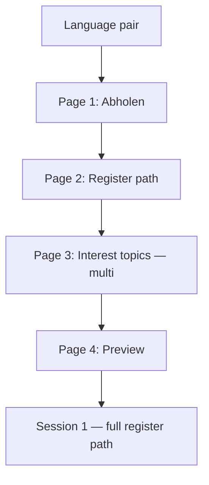

# 51 · Register path + interest topics — full immersion, not a sprinkle

**Status:** study only — no implementation.  
**⚠ Mix ratio superseded by [52](52-register-mix-ratio-calibration.md):** not 15/15
register cards; **2–3 per session** + spine + register sentences on all cards.

**Owner correction (2026-08-20, evening):** Studies [49](49-learner-intent-onboarding.md) and
[50](50-onboarding-popover-timing-and-skill-question.md) assumed the app would
**mix a few** register-tagged words into the general frequency queue. That felt
too weak. A first correction made session 1 **all register** — **also wrong**
([52](52-register-mix-ratio-calibration.md)). **Locked rule:** ~**2–3 register
cards per 15-card session** + basics spine + register-shaped sentences on every
card; **no decay**.

A second onboarding layer is needed: **interest topics** (Sport, Politik, …)
from which **news, articles, and example sentences** are drawn.

This chapter supersedes study 49 **§I2c–I3** (boost band) and extends study 50
(popover content).

Related: [37](../reviews/design/DR-037-content-and-method-setup-ux.md) (topic chips),
[48](archive/ARCH-048-content-licensing-and-adaptation.md) (news ingest),
[UC-007](../use-cases/UC-007-read-something-at-my-level.md),
[UC-019](../use-cases/UC-019-learn-for-something-specific.md).

---

## R0 · Two axes — register vs interest (do not merge)

| Axis | Question | Changes |
| --- | --- | --- |
| **Register path** | Business · Alltag · Technik · General | **Which language** you learn — vocabulary, card glosses, example sentences, speaking prompts, default news **register** |
| **Interest topics** | Sport · Politik · Klima · … (multi) | **Which stories** you read/hear **within** that register |

Example: **Business + Sport** → articles about the sports industry, sponsorship,
club finances — not cooking recipes in business tone.

Both are set in onboarding; both editable in Profile. Neither deletes prior learning
when changed.

---

## R1 · Why “mix a few” fails the owner test

### R1a · Learner experience

| “Mix a few” (study 49) | Owner intent |
| --- | --- |
| 15 cards: 10 general + 4 Business + 1 due | 15 cards: **Business path** — every card belongs to the chosen register |
| Example: *perro* with business boost on *cliente* | Example sentences: meetings, deadlines, invoices |
| Reading: generic news + occasional business lemma | Reading: **business news** at my level |
| Feels like: “They remembered one answer” | Feels like: “This app **is** my work German” |

### R1b · ESP research — register is a **course**, not a garnish **[B]**

English for Specific Purposes (Dudley-Evans; Hutchinson & Waters): learners need
the **lexis, register, and genre** of a **domain** — not every meaning of every
word in general English.

Corpus **keyness** (Scott; Sketch Engine): domain vocabulary is identified by
**over-representation in a focus corpus vs reference corpus** — *reunión,
contrato, presupuesto* in business texts, not “word #847 in general frequency
plus a tag.”

Maritime ESP textbook analysis (2026): effective materials balance a **GSL glue
layer (K1)** with **domain K3** — but the **learner experience** is domain-shaped;
glue is taught **inside** domain sentences, not as a parallel general deck.

Sources: [EBSCO ESP overview](https://www.ebsco.com/research-starters/language-and-linguistics/english-specific-purposes),
[JALT keyness poster PDF](https://jaltcue.org/files/OnCUE/OCJ9.2/OCJ9.2_pp102-110_Blake.pdf),
[Maritime ESP vocabulary profile](https://doi.org/10.35316/joey.2026.v5i1.37-47).

> **Product sentence:** Register is a **path** (ordered lemma curriculum + aligned
> content). Glue words exist; they do not **define** the session.

---

## R2 · Interest topics — research for news & sentences **[B]**

### R2a · Interest-matched readings raise motivation

REAP intelligent tutor (Heilman, CMU): ESL students given readings matched to
**stated topic interests** reported **higher interest** post-reading; learning
gains on practiced words were **somewhat higher** (randomized experiment).

Source: [REAP topic choice poster PDF](http://www.cs.cmu.edu/~mheilman/papers/heilman_topic_choice_AIED2007_poster_final.pdf).

Interest-Based Language Teaching (IBLT, nursing students): materials selected by
**learner interest areas** improved **situational interest** and **reading
comprehension** vs generic materials.

Source: [IBLT reading study PDF](https://ijltr.urmia.ac.ir/article_120633_1e660faf88483b832d2d6ed2d4e1f7e7.pdf).

CHI 2024 (n=272): AI-generated **context personalization** by user interest input
**increased learning motivation** (effect on quiz scores not significant in one
week — motivation is the validated win for onboarding).

Source: [Context personalization CHI 2024](https://doi.org/10.1145/3613904.3642393).

EuroCALL 2025 (n=140, 2×2 design): **topic + level personalization together**
beat either alone on motivation — supports collecting **both** register path and
interest topics upfront.

Source: [GAI personalization EuroCALL 2025](https://doi.org/10.4995/eurocall.2025.23979).

### R2b · Already in the product model — onboarding should **seed** it

[37](../reviews/design/DR-037-content-and-method-setup-ux.md): methods declare `materialTopics`; learner
picks chips (*News*, *Environment*, …); catalogue Sources carry matching `tags[]`.

Today that choice is **per session on method detail**. Owner wants interests
**declared once in onboarding** so:

- Default chip on reading/listening = learner's interests  
- Catalogue ingest prioritizes fetching/tagging those topics  
- Example sentences on **cards** prefer corpus lines tagged with interest + register  

Onboarding **does not replace** method-detail chips — it sets **defaults** the
learner can override per session.

---

## R3 · Revised onboarding popover (owner-aligned)

Extends [50](50-onboarding-popover-timing-and-skill-question.md) — still **after
language pair, before session 1**, still **no skill fork**.



### Page 2 — Register path (single choice, required unless skip)

```
Wofür brauchst du die Sprache?

○ Business — Meetings, E-Mail, Büro
○ Alltag — Zuhause, Reise, Alltag
○ Technik — Docs, Tools, IT
○ Allgemein — ohne Schwerpunkt
```

### Page 3 — Interest topics (multi-select, 1–3)

```
Was interessiert dich in Nachrichten & Texten?

[ Sport ] [ Politik ] [ Klima ] [ Kultur ]
[ Wirtschaft ] [ Tech ] [ Gesundheit ] [ Reise ]

(Wähle 1–3 — daraus kommen Artikel & Beispielsätze)
```

**Not free text v1** — same chip pattern as method detail ([37](../reviews/design/DR-037-content-and-method-setup-ux.md));
discoverability over open search.

### Page 4 — Preview (honest)

```
Business · Sport + Wirtschaft

Deine ersten Wörter: reunión, agenda, presupuesto, …
Beispielsätze aus Büro- und Wirtschafts-News.
Lesen: adaptierte Artikel zu Sport & Wirtschaft.
```

[ Erste Session starten ]

---

## R4 · Register path — what actually changes (concrete)

### R4a · Vocabulary sessions (SRS)

| Layer | Old (study 49 boost) | **New (register path)** |
| --- | --- | --- |
| Card queue | Global frequency + 1.25× sprinkle | **`registerPath` ordered list** for chosen register |
| Session 1 | Ranks 1–15 **within Business path** | **2–3 register + 12–13 spine** ([52](52-register-mix-ratio-calibration.md)) |
| Example sentence on card | Generic or random | **From register + interest corpus** |
| G1 reason | "Boosted: Business" | **"Business path · Wort 7/200"** |
| Form recall | Same staging | Forms practiced in **register sentences** |

Each register path is a **curated ordered lemma list** (~200–400 for phase 1,
~800 for “comfortable register”) built from keyness + pedagogical ordering (glue
 lemmas embedded early **in domain sentences**).

**General path** = today's frequency-ordered starter deck — unchanged.

### R4b · Speaking / production (study 24 default)

Prompts pulled from register templates:

- Business: *"Fasse die Besprechung in drei Sätzen zusammen."*
- Alltag: *"Was hast du heute zum Frühstück gemacht?"*
- Technik: *"Erkläre dem Team, was der Fehler bedeutet."*

Not a separate skill question — production prompts inherit **register path**.

### R4c · Reading & news (UC-007 + study 48)

Filter pipeline for catalogue Source pick:

```
sources
  .filter(registerTag === learner.registerPath)
  .filter(topicTag ∈ learner.interestTopics)
  .sort(by coverage fit for this learner)
```

- **Lane B** (Wikinews CC BY): ingest and tag by topic + register  
- **Lane C** (generated): prompt includes register + interest constraints  
- **Full article** — unchanged (owner 2026-08-20)  
- Example sentences on **review cards**: same filter on sentence bank  

If no article matches **Business + Klima** today → honest empty state + nearest
 neighbour (*"Heute: Business + Wirtschaft — nichts zu Klima im Katalog"*) —
offer chip change, not silent fallback to generic.

### R4d · What “glue” still shares across registers

Function words (*de, que, por, en*) appear in **every** path — but always inside
**register-appropriate sentences**:

| Lemma | Business sentence | Alltag sentence |
| --- | --- | --- |
| *porque* | *Cancelamos porque el cliente no firmó.* | *Me quedé porque llovía.* |
| *pero* | *Queremos cerrar, pero falta el presupuesto.* | *Quiero salir, pero estoy cansado.* |

The learner never studies the same lemma twice under two registers unless they
**switch path** in Profile (held lemmas stay held).

---

## R5 · Data model (sketch)

```typescript
type RegisterPath = "business" | "everyday" | "technical" | "general";

type InterestTopic =
  | "sport" | "politics" | "climate" | "culture"
  | "economy" | "tech" | "health" | "travel";

type LearnerProfile = {
  registerPath: RegisterPath;
  interestTopics: InterestTopic[]; // 1–3 enforced in UI
  setAt: string;
};

type RegisterLemma = {
  lemma: string;
  pathRank: number; // 1..N within path
  register: RegisterPath;
  glue: boolean; // true = high cross-register frequency, still domain-sentenced
};

type ContentSource = {
  // existing fields…
  tags: string[]; // topic ids
  register: RegisterPath | "general";
};
```

**New data artefacts (per language):**

| File | Content |
| --- | --- |
| `data/register/es-business-path.json` | Ordered lemmas + sentence ids |
| `data/register/es-everyday-path.json` | … |
| `data/register/es-technical-path.json` | … |
| `data/sentences/es-business.json` | Example sentences keyed by lemma |
| `data/topics/topic-taxonomy.json` | Chip ids ↔ ingest tag rules |

---

## R6 · Panel review (UX · LT · DS · Content)

| Role | Verdict |
| --- | --- |
| **UX** | Popover **4 pages max**; interests multi-select 1–3; preview page mandatory; changing register in Profile = **"Neuer Pfad ab morgen — dein Fortschritt bleibt"** |
| **LT** | Full register path **yes**; glue in domain sentences **yes**; never 80% general deck — ESP-aligned |
| **DS** | One `registerPath` pointer per learner; session builder reads **path rank** not global `frequencyRank`; log `pathLemmaIndex` |
| **Content** | Long pole: 3 paths × 2 langs × sentence bank + Wikinews tagging; start **Business ES** slice only |

**Withdrawn:** study 49 `domainBoost` 1.25×, `maxBoostedPerSession`, boost decay.

---

## R7 · Phased delivery

| Phase | Scope | Learner sees |
| --- | --- | --- |
| **P0** | Onboarding popover + profile storage only | Choices saved; **General path** still runs until P1 |
| **P1** | Business path ES — 200 lemmas + sentences | Business session 1 = **all Business** |
| **P2** | Interest filter on card example sentences | Sentences match Sport/Wirtschaft chips |
| **P3** | Catalogue news filtered by register + interest | Reading method defaults |
| **P4** | Alltag + Technik paths; IT language | Full owner vision |

---

## R8 · Open questions

1. **Path length before bridge** — stay on Business-only until 200 held, or
   introduce 10% general maintenance earlier?  
2. **Interest without catalogue match** — Lane C generate, or wait for ingest?  
3. **Register on learner-uploaded text** (UC-029) — infer register or ignore?  
4. **Overlap** Business ∩ Wirtschaft interest — same tag or distinct?  
5. **UC-011** — four popover pages vs three (merge preview into page 3)?

---

## R9 · Feature catalogue (draft)

| # | Feature | Ev. | Eff. | Verdict |
| --- | --- | --- | --- | --- |
| F225 | Register path curriculum (ordered lemma lists) | B | L | **V1 candidate** — Business ES first |
| F226 | Onboarding interest topics (1–3 chips) | B | S | **V1 candidate** |
| F227 | Example sentences from register + interest corpus | B | M | **V1** after F225 |
| F228 | News/article filter by register + interest | C | M | **V2** — needs T-CI ingest |
| ~~F220~~ | ~~Domain boost 1.25× in session sampling~~ | — | — | **Withdrawn** — replaced by F225 |

---

## R10 · Supersession map

| Chapter | Still valid | Withdrawn |
| --- | --- | --- |
| [49](49-learner-intent-onboarding.md) | Transparency, G1, profile edit, UC-019 link | Boost band §I2c–I3, F220–F222 boost framing |
| [50](50-onboarding-popover-timing-and-skill-question.md) | Timing, no skill fork | Domain-only single question → add interests page |
| **51 (this)** | Register path + interest topics | — |

---

## Sources

| | Claim | Grade |
| --- | --- | --- |
| ⬤ | ESP = domain lexis/register as curriculum unit | [B] — Dudley-Evans, EBSCO |
| ⬤ | Keyness identifies domain vocabulary vs general frequency | [B] — corpus linguistics |
| ⬤ | Interest-matched readings ↑ interest (REAP) | [B] — Heilman AIED 2007 |
| ◐ | IBLT ↑ interest + reading comprehension | [B] — IJLTR nursing study |
| ◐ | Topic personalization ↑ motivation (GAI study) | [B] — CHI 2024 |
| ◐ | Topic + level personalization together best | [C] — EuroCALL 2025 |
| ⬤ | Topic chips + Source tags already in spec | [A] — study/37, method-material-setup |
| ⬤ | Owner: full register path not sprinkle | [D] — 2026-08-20 correction |
